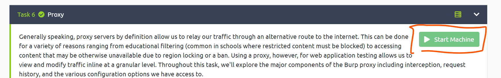
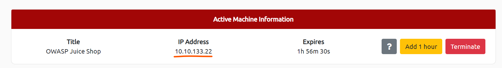
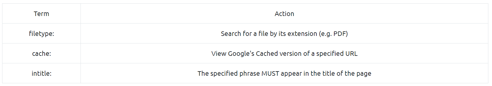
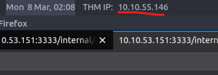

# Try Hack Me Solutions


[tryhackme.com](https://tryhackme.com/) is a website containing cyber security problems/questions. 

Try Hack Me is organized into rooms that might have many problems relating to a central theme. To attempt the problems, one needs to open a connection to AttackBox, a web-based connection to a Kali machine. Alternatively you can use OpenVPN. For free users there exists a time limit on using the machine, but people with subscriptions, it is unlimited max machine open is 3. 


## Path

1. Start with the tutorial which will help you set up
2. Next do an easy challenges such as [Vulnversity](https://tryhackme.com/room/vulnversity) although this one is a bit long ans something like [Web Fundamentals](https://tryhackme.com/room/webfundamentals) might be easier 
3. Do some more easy/tutorial ones to get your feet wet


<a name=top></a>

## Index

1. [Tutorial](#begin)
2. [Welcome](#welcome)
3. [OpenVPN](#openvpn)
4. [Web Fundamentals](#webf)
5. [Intro to Python](#python)
6. [Burp Suite](#burp)
7. [Linux Series (1-3)](#linux)
   1. [Part 1](#l1)
   2. [Part 2](#l2)
   3. [Part 3](#l3)
8. [Windows Intro](#introwindows)
9. [Google Dorking](#googled)
10. [How Websites Work](#introwebsite)
11. [Introductory Networking](#inetwork)
12. [Hashing - Crypto 101](#hash101)
13. [Intro Shells](#ishell)
14. [Nmap](#nmap)
15. [Hydra](#hydra)
16. [Active Directory Basics](#adb)
17. [John the Ripper](#john)
18. [Common Linux Privesc](#CLP)
19. [Metasploit](#Metasploit)
20. [Encryption - Crypto 101](#encryption)
21. [Linux PrivEsc](#linuxesc)
22. [Vulnversity](#vulnversity)
23. [Network Services](#ns)
24. [Network Services 2](#ns2)
25. [OhSINT](#OhSINT)
26. [OWASP Top 10](#owasp)
27. [Kenobi](#Kenobi)
28. [Basic Pentesting](#bp)
29. [Mr Robot CTF](#mrrobot)
30. [Blue](#blue)
31. [Ice](#ice)
32. [Steel Mountain](#sm)


<a name=begin></a>

### [Tutorial](https://tryhackme.com/room/tutorial)

1. Start a machine, this will take ~ 1-2 minutes for pro accounts
2. (Recommended) have two windows if 2+ monitors, 1 for Kali Linux window and another for the instructions
3. Follow instructions to get the flag and submit it


<a name=welcome></a>

### [Welcome](https://tryhackme.com/room/hello)

A nice intro to TryHackMe


<a name=openvpn></a>

### [OpenVPN](https://tryhackme.com/room/openvpn)

1. Download OpenVPN and install it
2. Download the configuration files from TryHackMe
3. Load the config file onto OpenVPN
4. Connect
5. ssh into server


<a name=webf></a>

### [Web Fundamentals](https://tryhackme.com/room/webfundamentals)

Good place to start out

Instead of using curl in the command line, using postman to send requests might be easier


<a name=python></a> 

### [Intro to Python](https://tryhackme.com/room/introtopython)

Trivial

Do for last step (\* note txt is the text file containing the task file)

```python
import base64

with open("txt", "r") as fp:
    flag = f.read()

for i in range(5):
    flag = base64.b16decode(flag)

for i in range(5):
    flag = base64.b32decode(flag)

for i in range(5):
    flag = base64.b64decode(flag)

print(flag)
```

Then run with `python3 t.py` or whatever u named your python file


<a name=burp></a>

### [Burp Suite](https://tryhackme.com/room/rpburpsuite)

Follow instructions, mostly straight forward

Task 6 (some step in the middle) the question that starts with "Return to your web browser and navigate to the web application hosted on the VM we deployed just a bit ago", this web application is deployed/started in Task 6 (show below)



The URL to enter is the one at the top of the page in a red box (see below)




<a name=linux></a>

### [Linux Series](#)

<a name=l1></a>

#### 1. [Part 1](#https://tryhackme.com/room/linux1)

Simple and easy -> do it in any Linux distro except for **Task 9**, but that's just my friend *pinguftw* for the answer if you can't be bothered to run the binary :p

<a name=l2></a>

#### 2. [Part 2](https://tryhackme.com/room/linux2)

\* Remember to start the machine (which is different from the attack box)


This one has a lot of useful information and here are some that I did not know:

* `;` operator is the same as `&&` but does not need to execute successfully

  

<a name=l3></a>

#### 3. [Part 3](https://tryhackme.com/room/linux3)

This part goes through some more tools and commands for us to go into. 

Task 7 -> `find / -name shiba4 2>/dev/null` (idk what `2>/dev/null` does but it works)


<a name=introwindows></a>

### [Windows Intro](https://tryhackme.com/room/intro2windows)

A simple intro to the Windows operating system. This barely counts as a room, but it is what it is.


<a name=googled></a>

### [Google Dorking](https://tryhackme.com/room/googledorking)

Google, SEO, and indexing!

Notice for me:




<a name=introwebsite></a>

### [How Websites Work](https://tryhackme.com/room/howwebsiteswork)

Easy intro into web dev and how websites work


<a name=inetwork></a> 

### [Introductory Networking](https://tryhackme.com/room/introtonetworking)

Networking stuff (Mostly IT/network stuff)


<a name=hash101></a> 

### [Hashing - Crypto 101](https://tryhackme.com/room/hashingcrypto101)

Intro cryptography

Task 4, Last question -> check length with Python

`len("HASH")`

For Task 5, to crack, use

`hashcat -m NUM hash rockyou.txt ` where hash is the txt file containing the hash  and change NUM to whatever the code for your hash type (found here: https://hashcat.net/wiki/doku.php?id=example_hashes). Also note that rockyou.txt was saved in the same directory level as the hash file

\* Note this may take a while


<a name=ishell></a> 

### [Intro Shell](https://tryhackme.com/room/introtoshells)

You can do the questions in order, but a better idea is to go to the bottom (task 14/15), start those machines and test the other tests with the open machine while AttackBox is open


<a name=nmap></a> 

### [Nmap](https://tryhackme.com/room/furthernmap)

Task 3 -> recommended to redirect output to text file like this

`nmap -h > t.txt` then grep the output of the t.txt to find the answer like this

`cat t.txt | grep -in -e 'FIND TEXT'`

To get the answers most of the time and line number if you do not find it immediately


<a name=hydra></a> 

### [Hydra](https://tryhackme.com/room/hydra)

Nice and simple intro to Hydra (you can use Burp for intercept)

\* note the usual word list rock you and it is found in `/usr/share/wordlists/rockyou.txt ` on the attack box by default


<a name=adb></a> 

### [Active Directory Basics](https://tryhackme.com/room/activedirectorybasics)

Reading assignment :weary: 

(Don't be afraid to use the hint for the second last part)


<a name=john></a> 

### [John The Ripper](https://tryhackme.com/room/johntheripper0)

Use rockyou.com for test: [rockyou.txt wordlist](https://github.com/brannondorsey/naive-hashcat/releases/download/data/rockyou.txt)

For cracking in task 4, use `john hashX.txt --wordlist=../rockyou.txt` if rockyou.txt is in the directory above yours

In Task 9-11, zip2john, rar2john, and ssh2john are not found so install it manually or just enter 

`pass123` as the passcode zip and

`password` for the rar (you also need unrar)

`mango` for the ssh key


<a name=CLP></a> 

### [Common Linux Privesc](https://tryhackme.com/room/commonlinuxprivesc)

This video series covers this room in great detail: https://www.youtube.com/watch?v=PjjuZwVvCgc


<a name=Metasploit></a> 

### [Metasploit](https://tryhackme.com/room/rpmetasploit)

Follow the steps and/or watch the video (which contain the answers)


<a name=encryption></a> 

### [Encryption - Crypto 101](https://tryhackme.com/room/encryptioncrypto101)

Task 4 -> use python interrater


<a name=linuxesc></a> 

### [Linux PrivEsc](https://tryhackme.com/room/linuxprivesc)

Good resource for escalation later on (definitely a good bookmark)


<a name=vulnversity></a>

### [Vulnversity](https://tryhackme.com/room/vulnversity)

1. Run `nmap -A -sC -p- -oN vul.nmap 10.10.IP ADDRESS HERE*` on the instance of Kali 

2. Wait >10 minutes for it to resolve

3. Scan for hidden files by doing `gobuster dir -u http://<ip>:3333 -w /usr/share/wordlists`

4. Go to the \<ip>/internal/index.html on firefox (**Make sure u aren't using http or https before the url**)

5. Follow the rest of the steps till yo get to injecting the PHP code

6. Make sure download the PHP file from GitHub, rename it to be a .phtml and change the IP to the TMP IP address

   

7. Save, upload, listen, then submit file

8. Then the netcat should allow you in such that you can gain control and find out things about the machine

9. Follow https://n0w4n.nl/vulnversity/#crayon-60458bd07482b875406373 to gain admin privileges

10. Follow the rest of the instructions and you should be done! 🥳

Resources: 

* https://n0w4n.nl/vulnversity/
* https://www.youtube.com/watch?v=hvYWCegfEZs&ab_channel=JohnHammond


<a name=ns></a> 

### [Network Services](https://tryhackme.com/room/networkservices)

see [YouTube 1](https://www.youtube.com/watch?v=eedTXtYiOK4), [YouTube 2](https://www.youtube.com/watch?v=qcvZ2Jm8fPU), or [YouTube 3](https://www.youtube.com/watch?v=18bHDxj1JpE) for hints


<a name=ns2></a> 

### [Network Services 2](https://tryhackme.com/room/networkservices2)

`/usr/sbin/showmount` is just `showmount` (Task 3)

Some parts maybe broken like the MySQL (also need to install MySQL)

A very good writeup: http://wuvel.net/network-services-2/#:~:text=What%20process%20allows%20an%20NFS,Mounting.


<a name=OhSINT></a> 

### [OhSINT](https://tryhackme.com/room/ohsint)

MSINT fun. Do some googling and don't be afraid of using the hint

For SSID of WAP, the website has changed the the answer is `UnileverWiFi`

Last question requires you to look in the source code (under the header)


<a name=owasp></a> 

### [OWASP Top 10](https://tryhackme.com/room/owasptop10)

Follow the steps till task 7, where the arthur task might be broken. Therefore the password is `d9ac0f7b4fda460ac3edeb75d75e16e`

In severity 3, you go into SQL. Notes on SQLite3:

* find the structure of the table with `.schema TABLE_NAME` in sqlite3

SSH key is usually located at `/home/falcon/.ssh/id_ra`

In take 16, it can be annoying to get the first 18 characters so use python by specifying 

```python
a = "KEY"
print(a[:18])
```

Severity 6: MSINT

Severity 7: Note that the alert must be case sensitive (ie `Hello`)

Severity 8: Task 21 is a trick question since it's `the Apache Software Foundation` 🙄

also note the first flag (cookie) requires a decoder


<a name=Kenobi></a> 

### [Kenobi](https://tryhackme.com/room/kenobi)

Follow the steps are the rest is trivial


<a name=bp></a> 

### [Basic Pentesting](https://tryhackme.com/room/basicpentestingjt)

Check The video (https://www.youtube.com/watch?v=xl2Xx5YOKcI)

This room should be done near the end because it requires a bunch of other tools and it requires you know how to pentest starting from nothing


<a name=mrrobot></a> 

### [Mr Robot CTF](https://tryhackme.com/room/mrrobot)

This is similar to [Blue](#blue), or at least the steps are the same, just some praxis


<a name=blue></a> 

### [Blue](https://tryhackme.com/room/blue)

The behaviour of msfconsole may very on your machine and therefore you may have to background once you do `run`.  Sometimes the run will fail and you may need to restart the machine 

(This room is a bit finicky)


<a name=ice></a> 

### [Ice](https://tryhackme.com/room/ice)

1561 is the one we want in task 3

Here I will break down the steps for general cracking:

1. Scan and recon
2. Hopefully find an exploit
3. Use metasploit (msfconsole)
   1. search for the exploit found
   2. set to use the exploit (with `use NUMBER`)
   3. set the host/port
   4. run (the exploit at the host)
4. Pray that you are successful
5.  Escalate 


<a name=sm></a> 

### [Steel Mountain](https://tryhackme.com/room/steelmountain)

Yet another Mr. Robot room 😅


## CI for PDF


🔝[Back to Top](#top)